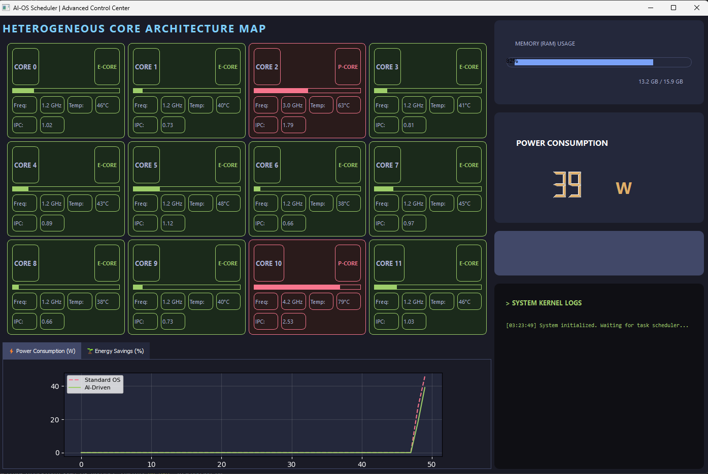
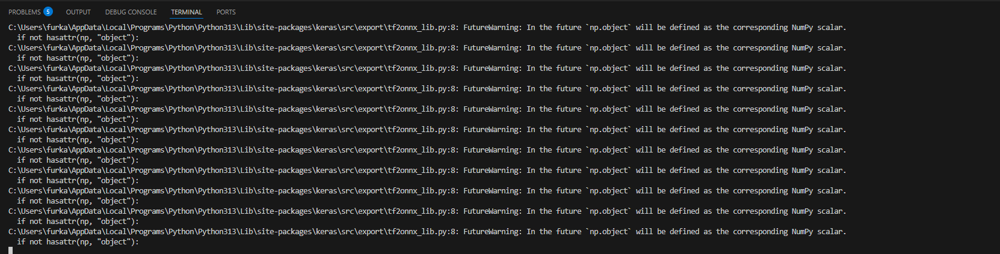
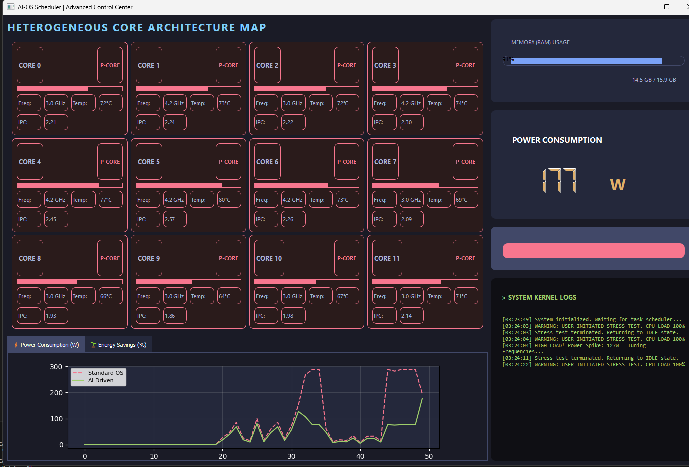

# AI-OS Scheduler (Advanced Scheduler)

An AI-based Scheduler designed for modern hybrid CPUs that balances performance and energy efficiency using a trained Deep Learning model.

---

## 📌 Overview

**What it does:**

This project uses a trained AI model to decide, in real-time, whether workloads should run on Performance Cores (P-Cores) or Efficiency Cores (E-Cores). The goal is to minimize energy consumption while keeping performance high. A PyQt5 **Dashboard** visualizes core states, power consumption, and energy savings. There's also a standalone CPU stress script used for testing.

> "Instead of using simple static rules, we trained a Deep Learning model that acts as the system's brain. The AI monitors real-time CPU/RAM and decides P-Core vs E-Core allocations. The Dashboard visualizes decisions and energy savings compared to a standard OS."


## 🚀 Features

- Real-time AI-driven core scheduling simulation
- PyQt5 GUI Dashboard with live graphs and kernel logs
- Built-in CPU stress test (GUI-controlled and standalone script)
- Includes pre-trained model (`advanced_scheduler_model.h5`) and scaler (`advanced_scaler.pkl`)


## ⚙️ Requirements

Recommended: Python 3.8–3.11 on Windows (project was tested on Windows).

Primary dependencies (see `requirements.txt`):

- numpy
- pandas
- scikit-learn
- matplotlib
- pillow
- pyqt5
- psutil
- pyqtgraph
- tensorflow (optional, required to run the Dashboard with the included model)

Note: Your `requirements.txt` file contains an inline comment on the `tensorflow` line — pip may fail if the inline comment remains. Remove any inline comments (or run `pip install tensorflow` separately) before installing.


## ✅ Installation (Windows)

1. Clone or copy the project folder to your machine.
2. Open PowerShell in the project root (where `main_dashboard.py` is located).
3. (Optional but recommended) Create and activate a virtual environment:

```powershell
python -m venv .venv
# PowerShell
.\.venv\Scripts\Activate.ps1
# CMD
# .\.venv\Scripts\activate.bat
```

4. Clean `requirements.txt` if needed (remove inline comments). Then install dependencies:

```powershell
python -m pip install --upgrade pip
python -m pip install -r requirements.txt
# or install tensorflow separately if you do not want it in the file:
# python -m pip install tensorflow
```

5. Verify the model files are present in the project root:
- `advanced_scheduler_model.h5`
- `advanced_scaler.pkl`

If these files are missing the Dashboard will exit with an error message: "Model dosyaları eksik!".

---

## ✅ Installation (Linux / macOS)

1. Clone or copy the project folder to your machine and open a terminal in the project root.
2. Ensure Python 3 and venv support are installed (Ubuntu/Debian example):

```bash
sudo apt update
sudo apt install python3 python3-venv python3-pip -y
# Install system deps for GUI/display if needed (Ubuntu example)
sudo apt install libgl1-mesa-glx libglib2.0-0 -y
```

3. Create and activate a virtual environment:

```bash
python3 -m venv .venv
source .venv/bin/activate
```

4. Upgrade pip and install Python dependencies (remove inline comments from `requirements.txt` if present):

```bash
python -m pip install --upgrade pip
python -m pip install -r requirements.txt
# or install tensorflow separately if required for the Dashboard:
# python -m pip install tensorflow
```

5. Verify `advanced_scheduler_model.h5` and `advanced_scaler.pkl` are present in the project root — the Dashboard exits if they are missing.

Notes: On some Linux distributions you may need to install additional system libraries to support PyQt5, matplotlib or TensorFlow; consult your distro's package manager and the relevant package docs.


## ▶️ Running the Project

- Start the Dashboard (GUI):

```powershell
python main_dashboard.py
```

The Dashboard window shows:
- A grid of CPU cores with P/E indications
- Real-time RAM and power readings
- Graphs for power consumption and energy savings
- `START STRESS TEST` button to run a 100% CPU load simulator

- Run the standalone CPU stress script (non-GUI):

```powershell
python main_cpu_stress.py
```

This script spawns a process per CPU core and stresses the CPU for ~30 seconds (can be interrupted with Ctrl+C).


## 📷 Screenshots & Assets

Included images (embedded below). Open the files from project root or view here in the repo:

- Dashboard screenshot: `main_image.png`
- Dashboard (terminal/console view): `main_image-terminal.png`
- Stress test view: `main_image_stress.png`
- Architecture diagram: `assets/architecture.svg`
- Simulator layout: `assets/simulator_layout.svg`

Example previews:








## 🛠 Troubleshooting

- "Missing the model files !" — make sure `advanced_scheduler_model.h5` and `advanced_scaler.pkl` are in the project root.
- GUI doesn't start / PyQt5 errors — ensure `pyqt5` is installed for your Python version.
- `pip install -r requirements.txt` fails — remove inline comments in `requirements.txt` and try installing packages separately.


## 🧩 Project Structure

```
├─ advanced_scheduler_model.h5
├─ advanced_scaler.pkl
├─ main_dashboard.py        # GUI dashboard
├─ main_cpu_stress.py      # simple CPU stress script
├─ requirements.txt
├─ main_image.png
├─ main_image-terminal.png
├─ main_image_stress.png
└─ assets/*.svg
```


## ✨ Tips

- If you don't need the Dashboard AI, you can run only `main_cpu_stress.py` (no TensorFlow required).
- To recreate the model or update it, add your training pipeline and save a new `*.h5` and scaler file.


## 📞 Need help?

If you'd like, I can:
- Clean `requirements.txt` (remove inline comments) and update it
- Add a simple `LICENSE` file
- Add a short CONTRIBUTING guide

---

Thank you
